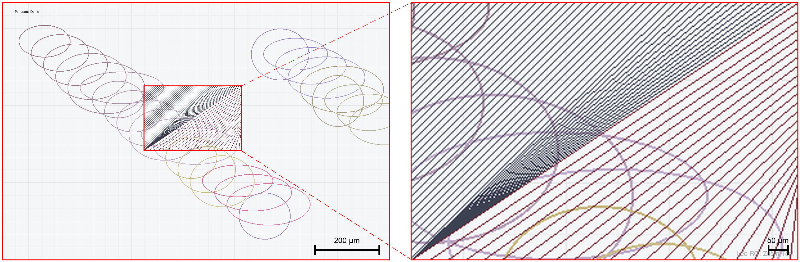

# Leo ROI Zoom Tool

科研图像局部放大图制作工具

**作者**: Leo Meng (Linghan Meng)
**版本**: 2.0

## 功能特性

- **自动ROI识别**: 使用模板匹配自动定位放大区域在全景图中的位置
- **多方向拼接**: 支持上/下/左/右四个方向放置放大图
- **比例尺**: 支持为全景图和放大图分别添加比例尺，可分别设置长度、像素/μm、颜色、线宽、字号与位置
- **比例尺位置联动/独立**: 可让全景图与放大图共用位置参数，也可分别独立设置
- **元素显隐**: 可分别隐藏全景外框、ROI选框、放大外框、引导连线、标尺文字，比例尺/标注/水印也可按需关闭
- **标注工具**: 箭头、星号、圆形、三角形、文字标注
- **水印**: 可添加自定义水印文字
- **批量处理**: 支持批量处理多组图像
- **实时预览**: 参数调整后自动预览（防抖）
- **快捷键**: Ctrl/Cmd+G 生成、Ctrl/Cmd+S 保存、Ctrl/Cmd+Z 撤销、Ctrl/Cmd+Shift+Z 重做

## 最近修复

- **撤销/重做逻辑修正**: 现在首次修改后即可正确撤销，并且撤销/重做顺序与界面状态保持一致
- **放大图比例尺参数修正**: 放大图比例尺现在会正确使用自己的线宽和字号设置，不再错误复用全景图参数
- **独立位置设置完善**: 当启用“全景图和放大图位置独立设置”后，可直接在界面中分别调整放大图比例尺的位置参数
- **虚线绘制防御性处理**: 对异常虚线段长/间隔参数做了兜底，避免极端输入导致绘制异常

## 安装依赖

```bash
pip install -r requirements.txt
```

或手动安装：

```bash
pip install opencv-python numpy pillow
```

## 使用方法

```bash
python roi_zoom_gui.py
```

## 实际使用截图

下图为项目核心流程生成的真实拼图结果示例（由 `demo_panorama.png` 与 `demo_zoom.png` 生成）：



示例输入文件位于：
- `docs/screenshots/demo_panorama.png`
- `docs/screenshots/demo_zoom.png`

## 快捷键

| 快捷键 | 功能 |
|--------|------|
| Ctrl/Cmd + G | 生成预览 |
| Ctrl/Cmd + S | 保存图像 |
| Ctrl/Cmd + Z | 撤销 |
| Ctrl/Cmd + Shift + Z | 重做 |
| Ctrl/Cmd + R | 重置ROI位置 |
| Escape | 取消当前操作 |

## 比例尺像素/μm计算

点击“计算”按钮，输入已知标尺的像素长度和实际长度即可自动计算比例。

## 文件说明

- `roi_zoom_gui.py` - 图形界面主程序
- `roi_zoom_tool.py` - 核心处理模块
- `.roi_zoom_config.json` - 配置文件（自动生成）
- `docs/screenshots/` - README 示例图资源目录

## 许可证

MIT License
